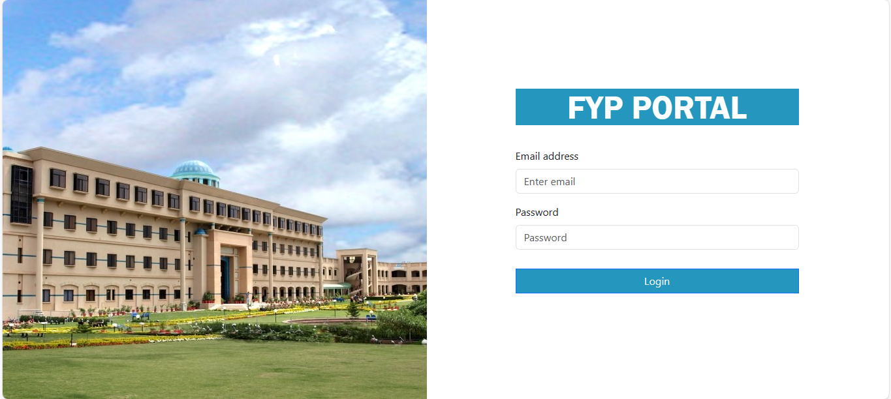

# Final Year Project Management System



## Introduction

The Final Year Project Management System aims to revolutionize the way educational institutions manage and conduct final year projects. By creating a web-based interface that simplifies the administrative workload and enhances communication among students, supervisors, and committees, this system provides a robust platform to streamline the entire project lifecycle. This project introduces the key functionalities and potential impacts of implementing such a transformative solution in an academic setting.

## Project Rationale

The rationale behind the Final Year Project Management System is grounded in the need to address the inefficiencies, communication barriers, and resource wastage commonly associated with the manual handling of final year projects (FYPs). Traditionally, managing FYPs involves cumbersome administrative tasks, prone to human errors, and lacks real-time tracking and collaboration tools, leading to miscommunication and dissatisfaction among students and supervisors. This system proposes to leverage advanced web technologies to automate and centralize the FYP management process, thus ensuring more efficient allocation of projects, seamless communication, and better tracking of project progress. By doing so, it aims to enhance the overall experience and outcomes of final year projects for all stakeholders involved, ultimately fostering a more productive and engaging educational environment.

## Project Architecture

The architecture of our Final Year Project Management System is designed around a three-tier model, comprising the presentation, business logic, and data access layers. This layered approach ensures a clear separation of concerns, making the system more manageable and scalable.

1. **Presentation Layer**: This is the front-end of the system, where users interact with the application. It's built using responsive web technologies to ensure accessibility across different devices, including mobiles, tablets, and desktops. The user interface is intuitive, designed to cater to the varied technical proficiencies of students, faculty, and administrative personnel.
   
2. **Business Logic Layer**: This middle layer processes the data input from the presentation layer, applying the necessary business rules and decisions. It acts as a mediator between the user-facing front end and the database, ensuring that data processing is handled correctly and efficiently. This layer is crucial for maintaining the integrity and the performance of the system.
   
3. **Data Access Layer**: The final layer is responsible for managing data storage and retrieval. It communicates with a centralized database that stores all user data, project information, evaluations, and other relevant data securely. This layer uses modern database management systems to ensure fast access times and data consistency.

The choice of a three-tier architecture is justified by its scalability, maintainability, and flexibility. By separating the system into distinct layers, we enhance its robustness against changes and simplify the debugging and updating processes. For instance, if new user requirements emerge or technology updates are needed, changes can be made in specific layers without affecting the others. Moreover, this architecture supports the principles of modular design, which is essential for both the incremental development process and future enhancements, aligning perfectly with the agile methodologies adopted in our project management.

## Installation Instructions

1. **Clone the repository**:
    ```bash
    git clone https://github.com/IrtiqaHaider/FYP-Management-System.git
    cd final-year-project-management-system
    ```

2. **Install dependencies**:
    ```bash
    npm install
    cd client
    npm install
    cd ..
    ```

    ```

4. **Run the application**:
    1. **Open a terminal and navigate to the frontend**:
        ```bash
        cd client
        npm run dev
        ```
    2. **Open another terminal and navigate to the backend**:
        ```bash
        cd ..
        cd server
        node index.js
        ```

## Technologies Used

- **MongoDB**: Database for storing project data.
- **Express**: Web framework for building the server-side application.
- **React**: Front-end library for building the user interface.
- **Node.js**: JavaScript runtime for server-side programming.

